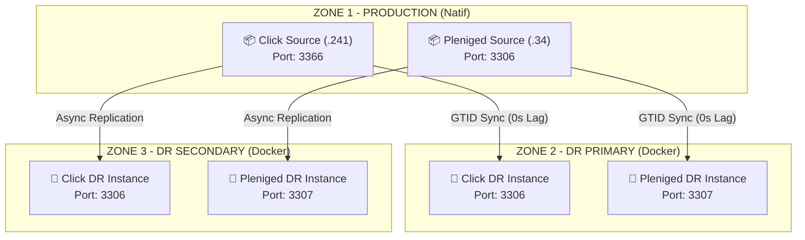

# 🏦 BNM Disaster Recovery Playbook
## Strategic Data Protection System — MySQL 8.0 Multi-Instance

> [!IMPORTANT]
> **Direction des Systèmes d’Information (DSI)**
> Ce dépôt contient les procédures critiques pour la survie des données bancaires en cas de sinistre majeur sur le site de production.
> **Statut actuel :** 🟢 Opérationnel (Site de Secours Click Sync à 100%)

---

## 🏛️ Architecture du Projet
Le projet repose sur une architecture **Multi-Instance Containerisée** assurant une séparation étanche entre les flux de paiement (Click) et les flux documentaires (Pleniged).

### Schéma de Réplication Global

---

## 🛠️ Stack Technique
- **Moteur DB :** MySQL 8.0 Community Edition
- **Isolation :** Docker Engine v24+ & Docker Compose v2.0+
- **Protocole :** Réplication basée sur les **GTID** (Global Transaction Identifiers)
- **Sécurité :** Authentification `mysql_native_password` & Chiffrement RSA
- **Filtrage :** Bypass des bases de test (`--replicate-ignore-db=click`)

---

## 📖 Navigation dans le Playbook

| Phase | Guide de Référence | Objectif |
| :--- | :--- | :--- |
| **01** | [**Stratégie Architecture**](01_dr_architecture_strategy.md) | Comprendre le choix Semi-Sync / Async. |
| **02** | [**Configuration Maître**](02_master_config_guide.md) | Paramétrer les serveurs sources (Ports 3366/3306). |
| **03** | [**Mise en Service DR**](03_start_replication_guide.md) | Déployer les esclaves et lancer la synchrone. |
| **04** | [**Validation de Données**](04_validation_replication_guide.md) | Tester la réplication en temps réel (Grand Direct). |
| **05** | [**Base de Connaissances**](05_dr_troubleshooting_knowledge_base.md) | Solutions aux erreurs (`ContainerConfig`, GTID, etc.). |

---

## 🚨 Procédure de Failover (Sinistre)
En cas de perte totale du site de production :

1. **Activation :** Sur les serveurs DR, désactiver le mode lecture seule.
   `SET GLOBAL read_only = 0;`
2. **Redirection :** Mettre à jour les DNS ou les fichiers de config applicatifs vers les IPs DR.
3. **Validation :** Vérifier que les derniers GTID ont été appliqués avant d'ouvrir le trafic.

> [!CAUTION]
> Un Failover est une opération critique. Ne jamais le déclencher sans l'accord de la DSI.
