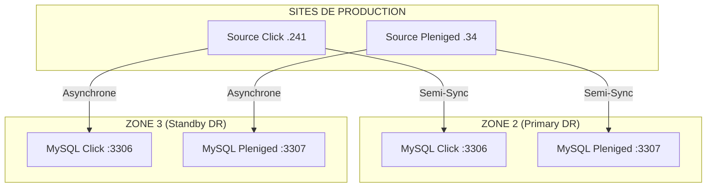

# 🏦 Projet DR MySQL — Banque Nationale de Mauritanie (BNM)

> **Direction Système d'Information — BNM**
> **Statut :** 🟢 Architecture Double-Instance Opérationnelle
> **Go-Live cible :** Fin Avril 2026

---

## 📋 Description du projet

Ce projet met en place une architecture de **Disaster Recovery (DR)** hautement disponible pour les systèmes critiques de la BNM. Contrairement à une architecture classique, nous utilisons une approche **Double-Instance** où chaque site de secours (Zone 2 et Zone 3) héberge une copie indépendante des deux systèmes :

- **Click** — Système de paiement mobile (Ubuntu Linux, `192.168.1.241`)
- **Pleniged** — Système de gestion documentaire (Windows 10, `10.168.2.34`)

---

## 🗺️ Architecture "Double-Conteneur"

Chaque serveur DR (`.66` et `.64`) fait tourner **deux conteneurs Docker** MySQL isolés :
1.  **Port 3306** : Instance dédiée à la sauvegarde de **Click**.
2.  **Port 3307** : Instance dédiée à la sauvegarde de **Pleniged**.

### Schéma des flux

---

## 📁 Guide des Fichiers (Mis à jour)

| Fichier | Importance | État |
| :--- | :--- | :--- |
| [**task.md**](task.md) | Suivi des tâches en temps réel | 🟢 À jour |
| [**mysql_docker_guide.md**](mysql_docker_guide.md) | Configuration des conteneurs (3306/3307) | 🟢 À jour |
| [**03_start_replication_guide.md**](03_start_replication_guide.md) | Commandes de démarrage (Semi-Sync/Async) | 🟢 À jour |
| [**05_monitoring_guide.md**](05_monitoring_guide.md) | Monitoring des 4 instances | 🟢 À jour |

---

## 🎯 Stratégie de Réplication

*   **Zone 2 (Hot Standby)** : Réplication **Semi-Synchrone**. Garantit que pour chaque transaction confirmée à la BNM, une copie existe physiquement sur la Zone 2 (**RPO = 0**).
*   **Zone 3 (Warm Standby)** : Réplication **Asynchrone**. Offre une redondance supplémentaire sans impacter la performance de la production en cas de latence réseau.

---

## 📞 Procédure d'urgence (Failover)

En cas de panne de production :
1.  Identifier si la panne est sur Click ou Pleniged.
2.  Aller sur le port correspondant de la **Zone 2** (3306 ou 3307).
3.  Lancer `STOP SLAVE; SET GLOBAL read_only=0;`.
4.  Rediriger les applications vers l'IP de la Zone 2 sur le port concerné.

> ✍️ Pour les détails complets, voir le [**Runbook de Failover (Guide 06)**](06_failover_test_guide.md).
