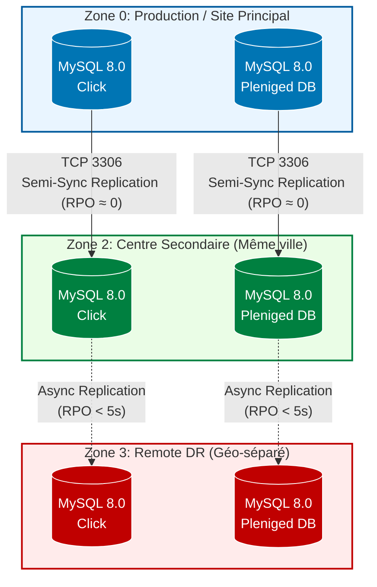

# Architecture DR MySQL (Click & Pleniged)

```mermaid
graph TD
    %% Zones Definition
    subgraph Zone0 ["Zone 0: Production / Site Principal"]
        style Zone0 fill:#E9F5FF,stroke:#005A9C,stroke-width:2px
        click_prod[("MySQL 8.0<br/>Click")]
        pleniged_prod[("MySQL 8.0<br/>Pleniged DB")]
    end

    subgraph Zone2 ["Zone 2: Centre Secondaire (Même ville)"]
        style Zone2 fill:#EAFDE6,stroke:#008040,stroke-width:2px
        click_dr[("MySQL 8.0<br/>Click")]
        pleniged_dr[("MySQL 8.0<br/>Pleniged DB")]
    end
    
    subgraph Zone3 ["Zone 3: Remote DR (Géo-séparé)"]
        style Zone3 fill:#FFEBEB,stroke:#C00000,stroke-width:2px
        click_remote[("MySQL 8.0<br/>Click")]
        pleniged_remote[("MySQL 8.0<br/>Pleniged DB")]
    end

    %% Network links & Replication Configuration
    click_prod -- "TCP 3306<br/>Semi-Sync Replication (RPO ≈ 0)" --> click_dr
    click_dr -. "Async Replication<br/>(RPO < 5s)" .-> click_remote

    pleniged_prod -- "TCP 3306<br/>Semi-Sync Replication (RPO ≈ 0)" --> pleniged_dr
    pleniged_dr -. "Async Replication<br/>(RPO < 5s)" .-> pleniged_remote

    %% Styling
    classDef primary fill:#0075B4,stroke:#fff,color:#fff
    classDef standby fill:#008040,stroke:#fff,color:#fff
    classDef remote fill:#C00000,stroke:#fff,color:#fff

    click_prod:::primary
    pleniged_prod:::primary
    
    click_dr:::standby
    pleniged_dr:::standby
    
    click_remote:::remote
    pleniged_remote:::remote
```
